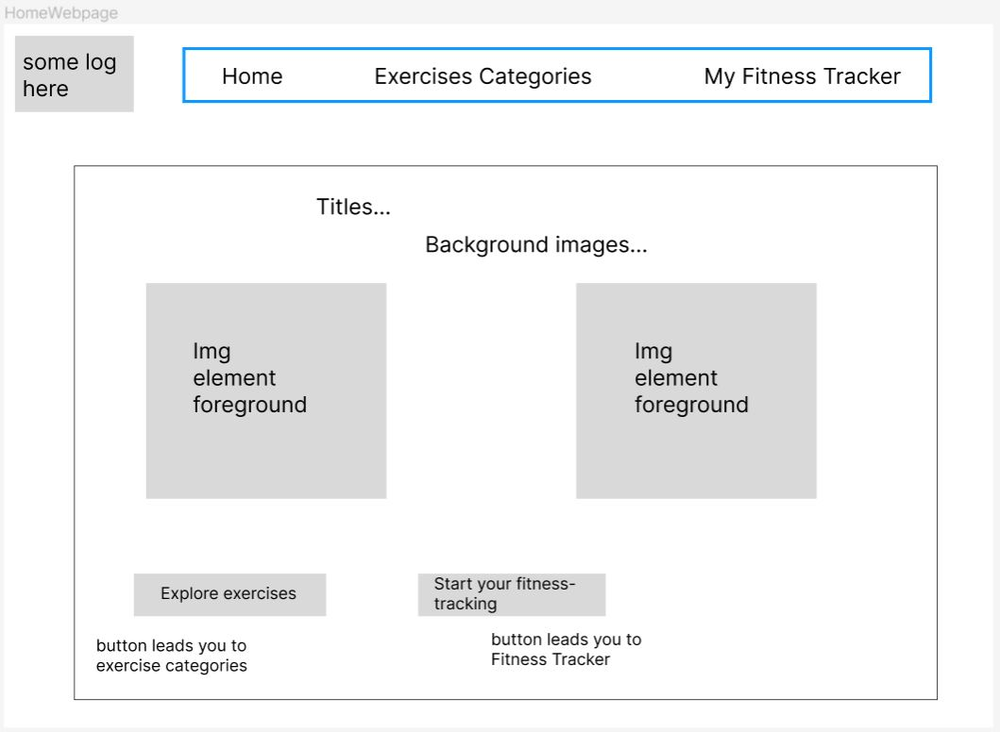
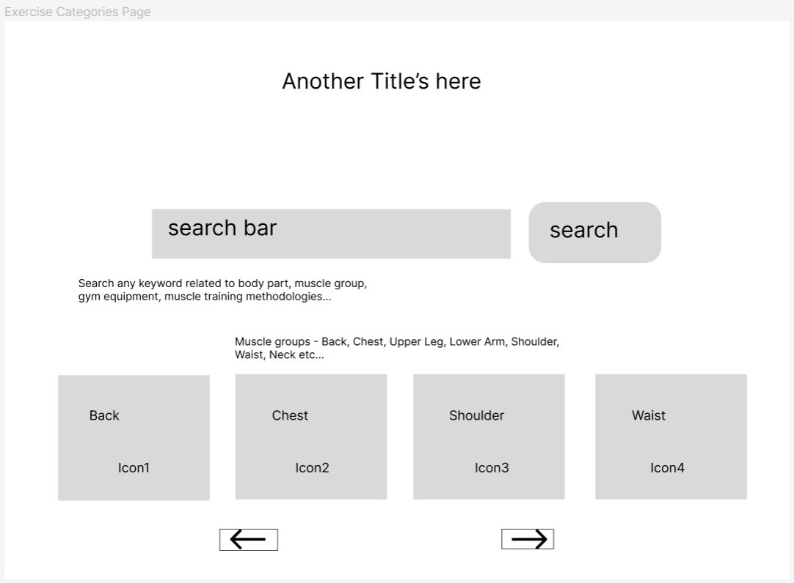
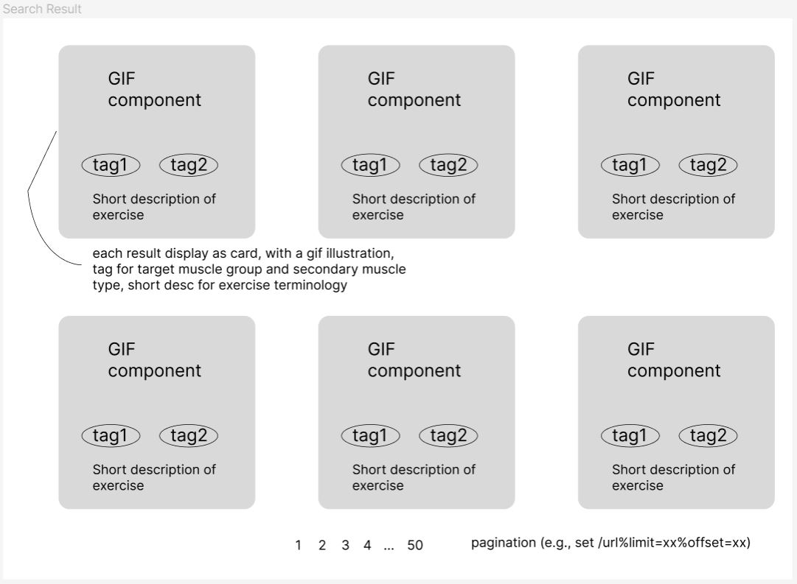
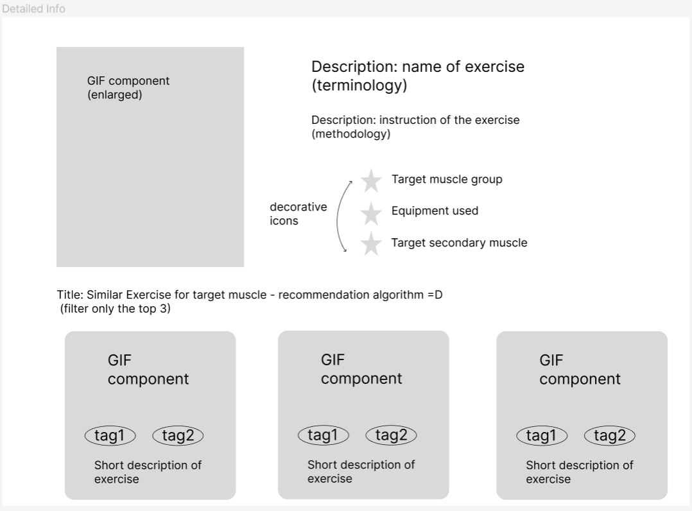
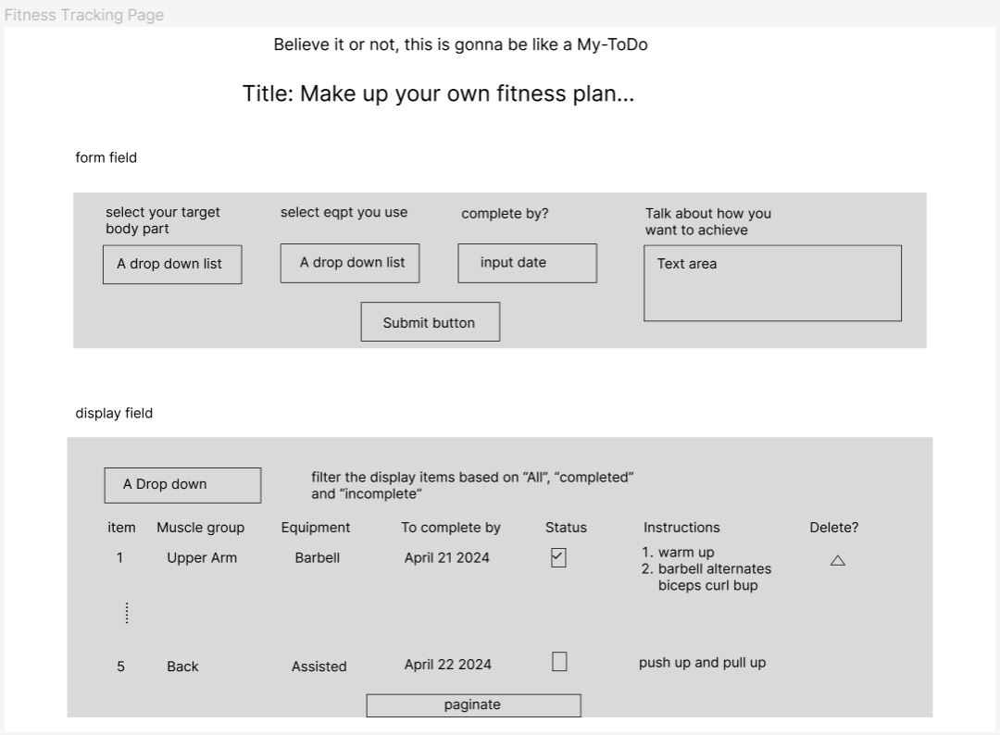
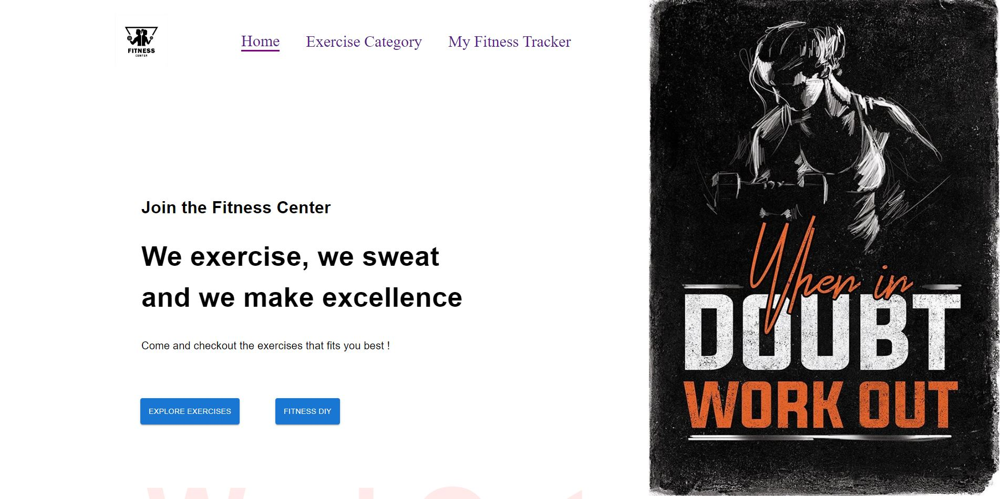
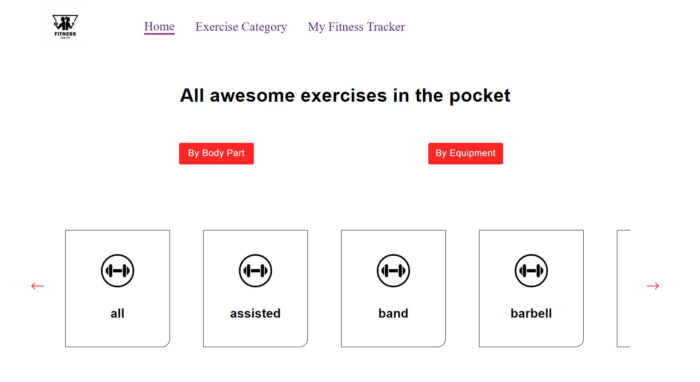
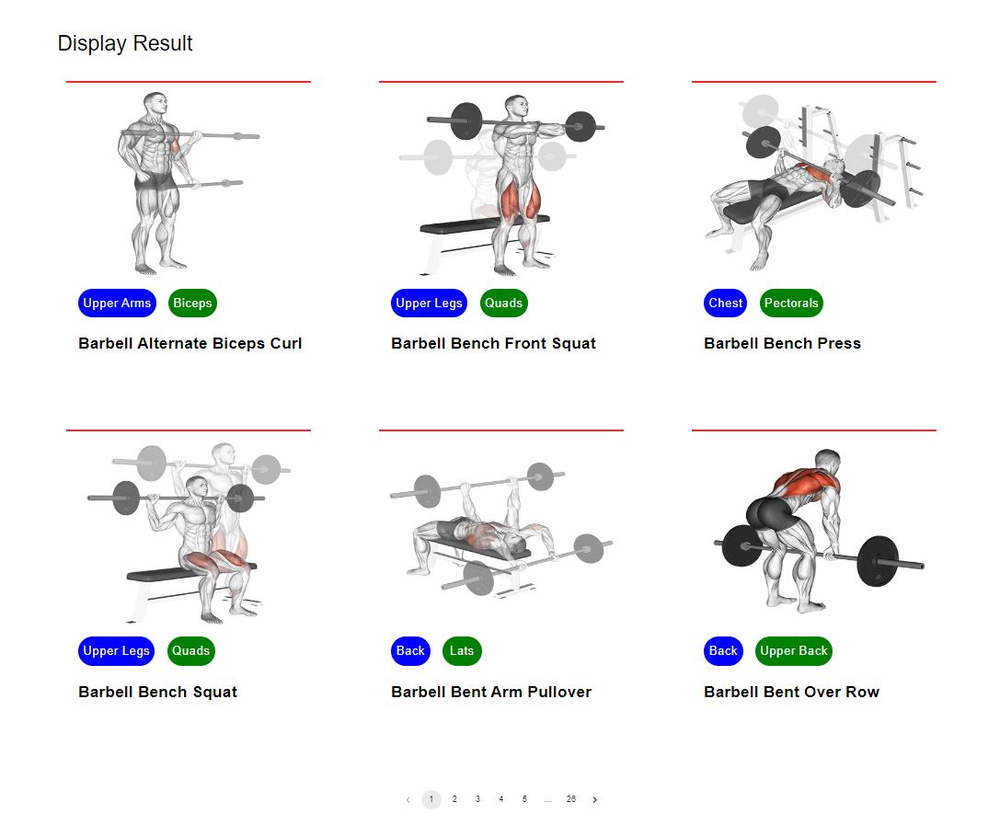
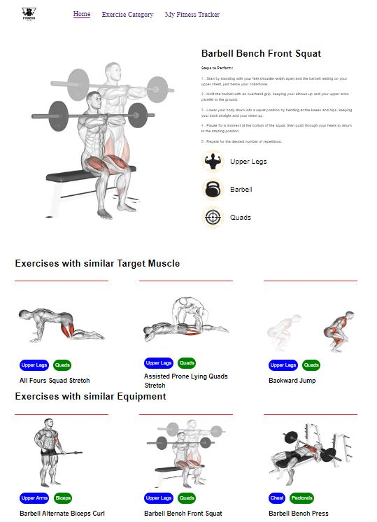
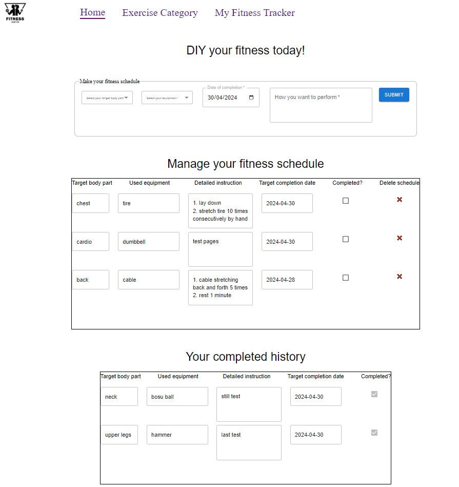

# Develop a Gym Lookbook and Fitness Tracking web app 

## App Description

#### Title: _Gym Exercises Handbook - an ultimate guide to develop your own fitness style today_
Background: As someone who loves workouts and used to gym a lot (yes, "used" to), I often browse through the net to find website that makes recommendations to the users like me on what type of exercises to do in the gym, how I can perform the exercises and what equipment I shall need. Even at home, I believe many would think if they can do some of the workouts in the comfort of home. And yesss, they can. What they will simply need are just some tips on the setup, instructional steps, and preferably some illustrations. That is the reason why this app is made. With the features on searching, filtering, one can target the exercise that best fits his/her needs. On top of that, the fitness tracking feature is probably adding some cherries to the cake. The users can use it to keep track of their potential to-dos in mind while looking out for workout options.

## App Design
Before getting into the codes. here are some drafted layouts of the web interface that the app was supposed to look like when the idea first evoked. Each component ideally represents one separate page.

<kbd>Home page</kbd>

<kbd>Exercise Categories /Search page</kbd>

<kbd>Result Display page</kbd>

<kbd>Individual Exercise Info page</kbd>

<kbd>My Fitness Tracker page</kbd>

## Technologies & Tools Used
Minimalist design - utilize only what has been deemed essential
- React (Vite)
- Material UI
- Airtable
- Bruno (API endpoint tester)
- Rapid API (API endpoint tester)
- Git & GitHub

## Deployment
The app is currently available at https://fitness-app-three-alpha.vercel.app/ for a limited period of time before the project phase concludes.

## Get Started
In the context of actual web development, the web UI may eventually look different from the wireframe. Below are some sample screenshots of the actual web appearance.

<kbd>Home page</kbd> : This is landing page as the app loads, where user navigates to other pages by clicking on the Nav Bar items or the two buttons.

<kbd>Exercise Categories /Search page</kbd> : User can browse through more than a thousand of exercises based on either equipment or body part categories. After user selects a specific category card, there is a window.scrollTo event that brings user to the <kbd>Result Display</kbd> which is integrated into the same page, with a smooth transition effect. Each exercise card contains a short description of the exercise, the body part involved, the muscle that is targeted for training, and a gif component.

<kbd>Individual Exercise Info page</kbd> : Clicking of the individual exercise card at the <kbd>Result Display</kbd> directs the user to another page where the detailed info of the selected exercise is displayed, this includes most of the info aforementioned, plus the detailed instructions on how to perform the setup and conduct the workout. On top of that, user can have a glimpse of the other similar exercises that utilize the same body part and equipment. 

<kbd>My Fitness Tracker page</kbd> : Last but not least, the fitness tracking is what the user essentially requires after viewing so many exercise tips and is ready to work things out by going to gym or doing in the comfort of their home. It is so simple to use, users can select the body part that they want to work on, select a equipment they may need, iron out some details on how they want to perform the workout, and don't forget to propose a date of completion. Finally, press the button to add it to the to-do list. Users can also manage their to-dos, by ticking the checkbox to mark the item complete, or pressing the delete to discard the unwanted schedule. The past completed to-dos can be viewed at the buttom of the page with ease of convenience. 

## API Used

- [ExerciseDB API](https://v2.exercisedb.io/docs/static/index.html#/)
- [Airtable Web API](https://airtable.com/developers/web/api/introduction)

## Future Enhancement
In a future perspective of this project, there is still room for improvements, which may include but not limit to features such as:

- Incorporate more search categories, such as secondary target muscle. Under each search category, include search refiner e.g., within body part search result, add equipment filtering option and vice versa. 
- Include another video query API so that user can not only view the GIF illustration, also watch some relevant videos on how others perform the selected exercise.  
- Implement edit feature to the fitness tracking such that user can modify the unwanted contents due to typo or mistyping instead of removing them.
- Enhance CSS styling with more considerations on user accessibility such as the display on different media devices. 

## Challenges During Development
The react component routing and rendering can be very complex sometimes if the structural layout has not been planned and thoroughly visualized prior to the implementation. I had encountered various situations where I needed to modify or add in components to fulfill some of the additional requirements, it soon became a mess because those were unexpected. I had some difficult times figuring out where I should place those changes, and for some instances I realized I would need some prop drilling and calling of some other components to achieve the objective and this was when the issues started arising. I would overlook some conditions, fail to pass props or pass the wrong props etc, these evetually led to a drastic increase of debugging difficulty by times. In some worse cases, restructuring of components may be required and the movement of codes around would make the previously functioning blocks enter non working state. All these problems could be foreseeable to some extent if I can iron out some possible alternatives beforehand. 

## Key Learnings
1. Always structure the components layout before putting them into place. Although it is hard to plan out everything properly before coding them, I may still make changes down the development path.
2. Break large-sized react component into smaller sub-components. This may not fit everyone's style, but generally a smaller component makes life relatively easier especially when I am troubleshooting a specific feature (like a button) on the app.
3. Double-check spelling, pay attention to similar or contradicting naming conventions. I had occasionally gone into the circumstances where there is no error output in browser console, yet the component did not work as intended because of typos. Make it a good habit to counter-check each line of code before moving on to next.
4. Learn and use logical operators and ternary expressions correctly can be very efficient in the time when conditional statement like if-else is not viable for use. 

## Reference 
- https://mui.com/material-ui/all-components/
- https://developer.mozilla.org/en-US/docs/Web/JavaScript/Reference/Global_Objects/Array
- https://react.dev/learn/updating-arrays-in-state
- https://www.npmjs.com/package/react-horizontal-scrolling-menu
- https://stackoverflow.com/questions/68862645/unable-to-only-select-a-single-material-ui-checkbox
